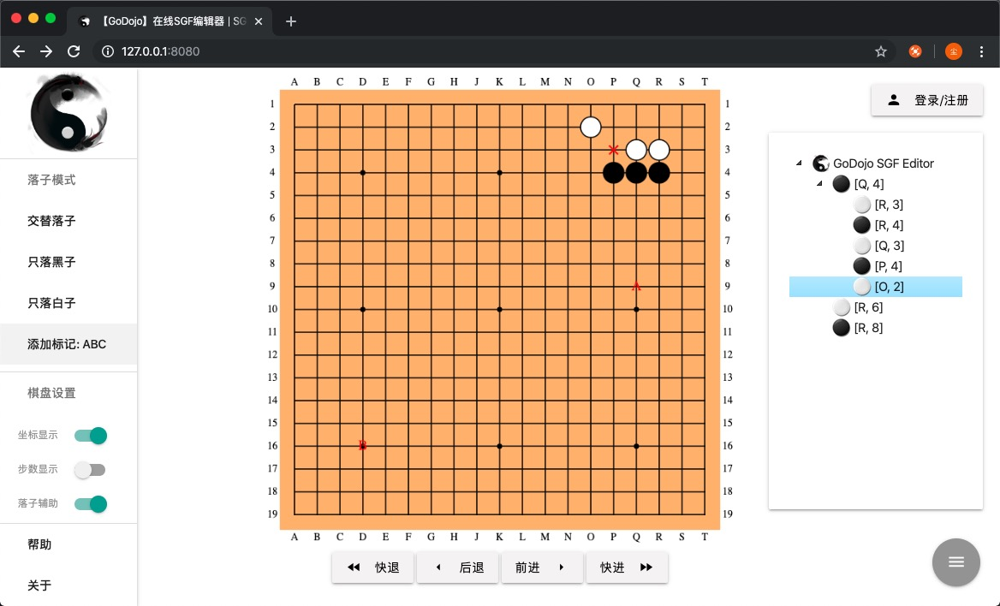

---
**GoDojoSGF** is an online SGF editor developed by GoDojo.CN. It's based on web technology stack, providing an elegant and convenient way to edit SGF file across all the platforms (Windows, MacOS, Linux, Android, iOS). The Editor allows user to create, edit, or open existing SGF files in any modern web browsers. You can add the editor into your web service by simply referencing the Javascript APIs and tweaking the parameters.

[![license][license-image]][license-url]
[![node version][node-image]][node-url]
[![jquery version][jquery-image]][jquery-url]
[![release][release-image]][release-url]

[license-image]: https://img.shields.io/badge/license-GPLv3-green 
[license-url]: LICENSE
[node-image]: https://img.shields.io/badge/node.js-%3E=_8.1-green
[node-url]: https://nodejs.org/download/
[jquery-image]: https://img.shields.io/badge/jquery-v3.4.1-green
[jquery-url]: https://code.jquery.com/jquery-3.4.1.min.js
[release-image]: https://img.shields.io/badge/release-latest-green
[release-url]: https://github.com/lskzsy/GoDojoSGF/blob/master/dist/GoDojoSGF.bundle.js

## Getting Started

Get source from github and run the following shell in `GoDojoSGF` folder:

```shell
# prepare development environment
git clone https://github.com/lskzsy/GoDojoSGF.git
cd GoDojoSGF
npm install
```
Building `GoDojoSGF.bundle.js`, which can used on other project:

```shell
npm run build
```

If you want to develop the project by demo, you can run the following shell:

```shell
npm run serve
```

then open http://127.0.0.1:8080 on your browser.

## Simple Uses

Create SGF object:

```javascript
const sgf = SGF.create({
    boardSize: 19,      /* optional, default is 19. Using '18:9' to build rectangle board */
    encoding: 'utf-8',  /* optional, default is 'utf-8' */
    application: '',    /* optional, SGF editor information */
    data: '',           /* optional, exists SGF data, the data will cover other configure */
    isKo: false,        /* optional, default is false. */
});
```

Show it on html:

```html
<div id="chessboard"></div>
```

```javascript
sgf.showOn('chessboard', {
    background: '#FFBA75',  /* optional, board color */
    branchColor: 'blue',    /* optional, branch mark color */
    markColor: 'red',       /* optional, flag mark color */
    lineColor: 'black',     /* optional, board split color */
    styleWidth: 400,        /* optional, board display width */
    styleHeight: 400,       /* optional, board display height */
    position: 'relative',   /* optional, workspace div position */ 
    bgMaterial: 'img/material_background_1.jpg',    /* optional, default is false */ 
    wstoneMaterial: 'img/white.png',                /* optional, default is false */ 
    bstoneMaterial: 'img/black.png'                 /* optional, default is false */ 
});
```

Change input mode:

```javascript
sgf.setInputMode('repeat');     /* put stone in turn */
sgf.setInputMode('w');          /* put only white stone */
sgf.setInputMode('b');          /* put only black stone */
sgf.setInputMode('markSQ');     /* put rectangle flag */
sgf.setInputMode('markCR');     /* put circle flag */
sgf.setInputMode('markTR');     /* put triangle flag */
sgf.setInputMode('markMA');     /* put cross flag */
sgf.setInputMode('markLB');     /* put letter flag */
```

Put stone on board:

```javascript
sgf.putStone(1, 5); /* put stone or mark on board, arguments is x and y for coordination */
```

Show/hide board coordinate:

```javascript
sgf.showCoordinate();
sgf.hideCoordinate();
```

Show/hide location prompt

```javascript
sgf.showPrompt();
sgf.hidePrompt();
```

Show/hide step

```javascript
sgf.showStep();
sgf.hideStep();
```

Control SGF proccess:

```javascript
sgf.left();
sgf.right();
sgf.continue();
sgf.back();
```

Resize board:

```javascript
sgf.resize($(document).width(), $(document).height());
```

Save SGF state:

```javascript
sgf.save(); // return sgf format string 
```

Listen SGF state:

```javascript
sgf.onStoneCreated((route, stone) => {});
sgf.onStoneDeleted((route) => {}) ;
sgf.onBranchMove((route) => {});
sgf.onSGFChanged((route, stone) => {});
sgf.onPlayerChanged((route) => {});
```

Open confirm mode(normally used in mobile)

```javascript
function stoneWaitConfirm() {
    sgf.confirmPutStone();  // stone will be created
    sgf.quitPutStone(); // quit the action
}

sgf.confirmMode(true, stoneWaitConfirm); // first argument is open/close, second argument is callback if someone click board
```

Jump to any step:

```javascript
const path = [2, 1]; // Jump to second step in branch 2 
sgf.jump(path);
```

Delete any step:

```javascript
const path = [2, 1]; // Delete second step in branch 2 and next...
sgf.delStone(path);
```

Comment step:

```javascript
sgf.addComment('text');
const text = sgf.getComment();
```
